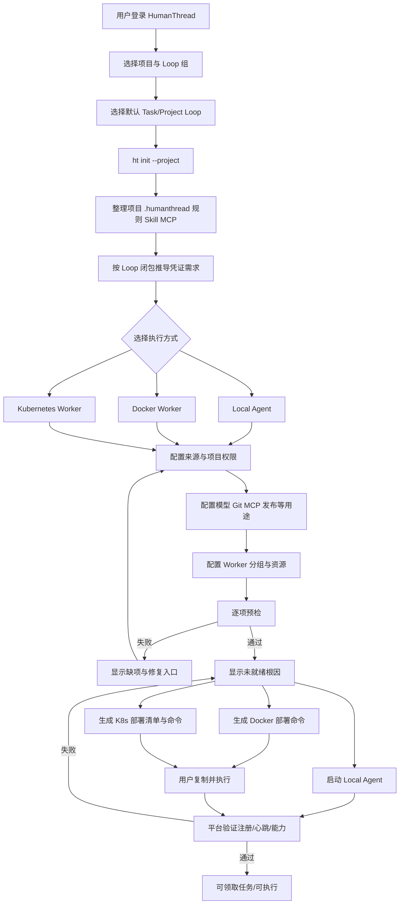

# 项目环境配置与 Worker 开箱架构评估

## 1. 结论

将配置、Worker 分组与资源统一纳入“项目配置 -> 环境设置”，并由平台生成 Docker/Kubernetes 的部署、更新、卸载命令，可以显著降低新项目和老项目的首次接入难度。平台只生成内容和提供校验，用户在自己的主机或集群中复制执行；平台不直接连接 Docker、Kubernetes，不创建容器、Deployment、PVC 或 Secret。

该架构满足“开箱简单、快速上手”的目标，但不是完全零配置。用户仍需准备 Docker/Kubernetes 权限、镜像仓库登录、外部 Secret/Nacos 访问和命令执行环境。平台应把这些前置条件显式化，不能把“命令已复制”或“命令返回成功”当作 Worker 已部署。

## 2. 目标结构

模板库（可选预设） -> 复制任务/项目 Loop 组到项目

项目 -> 任务 Loop 组（默认 Task Loop） + 项目 Loop 组（默认 Project Loop） -> 项目环境（单一环境） -> 执行端、资源和生命周期命令。

页面是唯一主入口，用户不需要先写 YAML 或理解 siteId、Pool、PVC、Deployment 等内部对象。高级用户可以查看变量名、配置版本和生成内容，但这些不是默认前置步骤。模板库不是项目运行时的父级依赖；模板应用后只将 Loop 组预设复制到项目，项目后续独立运行。

## 3. 模板库、Loop 组与默认流程

模板库保留，但定位为“Loop 组预设库/项目初始化向导”，不参与任务启动、Loop 选择或环境解析。用户可以不使用模板库，直接为项目配置 Loop 组。

每个模板预设至少包含：

- 任务 Loop 组；
- 默认 Task Loop；
- 项目 Loop 组；
- 默认 Project Loop；
- 可选的配置提示、能力提示和校验提示。

项目创建或项目设置时支持：

1. 多选模板预设；
2. 为每个预设标记是否作为默认预设；
3. 预览预设将复制的任务 Loop、项目 Loop 和默认 Loop；
4. 点击“一键应用”将预设复制到项目；
5. 应用后项目拥有独立的 Loop 组成员和默认 Loop，后续修改不回写模板库。

项目运行时只读取项目自身的两类 Loop 组：

```text
任务 Loop 组
  ├── 可用 Task Loop
  └── 默认 Task Loop
项目 Loop 组
  ├── 可用 Project Loop
  └── 默认 Project Loop
```

模板中的“里程碑发版 Loop”统一改为展示名“里程碑 Loop”。它仍然是一个 Project Loop，是否执行合并、测试、发布或审批完全由该 Loop 的规则决定，不代表平台预设生产发布语义。

## 4. 三种配置来源

三种方案应属于同一个环境配置模型，而不是三套互不相干的实现。每个配置项至少包含：用途、变量名、类型、来源、目标执行端、是否必需、校验方式、状态和版本。生产发布不建立额外的配置体系；它只是 Loop 环境中由用户规则定义的一种流程能力，Jenkins、Git、MCP、模型等与其他配置一样，仅作为被托管的凭证或配置来源。

### 4.1 HumanThread 方式（默认）

用户在环境设置中新增单个配置，选择 Worker、Local Agent 或两者，然后保存并校验。适合模型 API、Git、MCP、发布服务和其他运行时配置。敏感值只能加密保存或保存外部 Secret 引用，页面只显示已配置、脱敏摘要、最近验证时间和错误分类。

### 4.2 Nacos 方式

用户配置 Nacos 地址、namespace、group、dataId 或映射规则，并选择执行端。页面必须提供 namespace、group、dataId、配置键前缀和 TLS/鉴权方式的逐项引导。Nacos 访问凭据是引导凭据，必须独立保护。平台要限制可读取的 namespace/group/dataId，不能让 Worker 获得整个 Nacos 集群的通用权限，并提供连接、鉴权和目标配置读取校验。

### 4.3 项目配置文件方式

用户在页面指定项目相对路径，例如 .agent/.env.local 或项目约定的 .agent/.env.production.local。Local Agent 从当前工作区读取，Worker 从 checkout 后的任务分支读取。平台只保存路径、变量名和校验结果，不上传明文；路径必须限制在项目工作区内。若 Worker 当前分支没有该文件，页面必须明确显示“当前分支未找到配置文件”。

### 4.4 来源冲突

HumanThread、Nacos 和项目文件同时提供同名变量时不能静默覆盖，必须提示冲突并要求用户确认。项目中的配置文件是最高优先级；在没有项目文件配置时，再依次使用 HumanThread、Nacos 和本地进程环境。建议默认优先级为：项目配置文件 > HumanThread > Nacos > 本地进程环境。每次解析生成环境配置版本和脱敏指纹，执行记录只保存版本和来源摘要。

## 5. 页面引导流程

开箱必须先圈定 Loop 范围，再初始化项目本地规则，最后推导凭证和选择执行端。这样 `ht init --project` 只拉取用户已经选择的 Loop 框架，不会把平台中未使用的流程、Skill 或 MCP 混入项目。

1. 用户登录 HumanThread 并选择项目。
2. 选择任务 Loop 组、默认 Task Loop、项目 Loop 组和默认 Project Loop；可选从模板库多选预设并一键应用。
3. 在项目中执行 `ht init --project`，只拉取已选 Loop 的框架和可达依赖。
4. 在项目内引导整理 `.humanthread` 规则、Skill、MCP 和 Loop 具体约定；已有规则只读保护，初始化不得覆盖。
5. 基于已选 Loop 闭包、可达 SubLoop、节点、Skill、MCP 和本地规则推导真实凭证需求。
6. 区分 Local Agent 与 Worker 的配置可用性：Local Agent 可复用用户本机已有环境，Worker 必须准备独立来源。
7. 选择 Local Agent、Docker 或 Kubernetes，并配置对应的 Worker 分组、资源、副本、并发和持久化。
8. 选择配置来源：HumanThread、Nacos 或项目配置文件；项目配置文件优先级最高且默认只读，不自动改写已有 `.env` 文件。
9. 逐项校验并显示修复入口。
10. Docker/Kubernetes 分别生成部署、更新、卸载命令；Local Agent 直接启动。
11. 用户执行命令后回到平台验证 Agent/Worker 注册、心跳、能力和无副作用测试 claim。

页面默认展示“模型推理”“代码推送”“测试发布”等用途卡片，变量名作为高级信息展开。缺失项应显示目标执行端、来源和“立即配置”按钮，而不是让任务进入队列后才失败。

## 5. Worker 分组和资源

Worker 分组、项目 Linux Worker 资源、副本数、并发数、CPU、内存、GPU、临时空间、持久化容量和能力声明都属于环境配置。平台根据项目、环境和配置版本动态生成容器名、实例名、volume/PVC 名称、Deployment 名称、Secret 引用、健康检查和 Pool 注册参数。

Pool 身份与项目环境权限必须分离。Pool Token 只证明 Worker 属于某个池，不自动授权读取所有项目配置；Assignment 和校验任务仍需检查项目、项目环境、Worker Pool、Stage 和能力范围。Jenkins 等发布凭证不拥有特殊平台地位，只能在用户 Loop 规则声明的阶段被读取。

## 6. Docker 方案

Docker 适合个人开发机、单机服务器和小规模环境。平台生成固定镜像 digest、容器名、volume、资源限制、环境文件引用、健康检查和重启策略。命令只引用环境文件或 Secret，不拼接真实 Token。

Docker 的任务调度必须采用 Worker 固定绑定：任务一旦选择某个 Worker，后续该任务的继续执行、重试和恢复都必须回到同一个 Worker，不能切换到同组其他 Worker。原因是 Docker Worker 的工作目录和持久化文件按容器/volume 隔离，切换 Worker 会导致未提交文件、运行中间产物和本地状态不可见。平台应在任务快照中记录 Worker 实例身份，并在 claim、续租和恢复时强制校验；Worker 下线时任务应进入等待/阻塞或人工迁移流程，不能静默改派。

生命周期命令：部署负责首次幂等创建；更新应用新配置、镜像和资源并保留 volume、Pool 名称和实例身份，同时提供上一版本回滚命令；卸载默认删除容器而保留 volume，删除持久化数据必须是单独确认命令。Docker 的副本扩展不能改变已有任务的 Worker 绑定语义，新副本只接收尚未绑定的任务。

## 7. Kubernetes 方案

Kubernetes 适合团队、多副本、GPU、生产和高可用环境。平台生成版本化清单，包含 Deployment、PVC、ServiceAccount、Role/RoleBinding、ConfigMap、Secret 引用、资源限制和探针。Secret 优先使用 ExternalSecret、SealedSecret 或现有 Secret Store 引用。

Kubernetes 的任务调度与 Worker 实例解耦：Worker 以副本组运行，多个 Worker 共享项目环境指定的同一持久化存储。分支开发场景下，每个任务使用自己的任务分支和工作目录，任务之间不会因共享存储而互相覆盖；平台仍必须为每个任务建立独立的目录和分支边界。任务可以在同一 Worker 组内切换到任意健康副本继续执行，Worker 重启或扩缩容不改变任务身份。

共享存储必须满足并发访问和隔离要求：

- PVC/存储由平台按项目环境生成或引用，用户不需要手工命名；
- 每个任务使用独立的项目相对目录和分支，禁止直接使用共享根目录；
- Worker 领取任务前锁定任务目录，完成或失败后释放锁；
- 文件锁、任务锁和 Git 分支边界必须可恢复，不能依赖某个 Pod 的内存状态；
- 存储不可用、目录锁冲突或分支不一致时，任务进入阻塞/重试，不得让两个 Worker 同时写同一任务目录。

部署使用 kubectl apply -f .humanthread/<environment>/worker/；更新对同一份版本化清单执行滚动更新并等待 rollout，保留 PVC 和环境身份；卸载默认删除运行资源并保留 PVC，删除 PVC 必须是单独确认的命令。

Kubernetes Worker 组需要提供基于空闲副本的弹性扩缩容策略：

1. 用户配置最小 Worker 副本数，平台至少保持该数量运行。
2. 平台持续监控 Worker 的领取、运行、心跳和空闲状态。
3. 当空闲 Worker 数量为 0 且仍有待领取任务时，自动扩容，目标是至少保留 1 个空闲 Worker。
4. 当空闲 Worker 数量超过需求时，可以自动缩容，但待缩容副本必须连续空闲至少 1 分钟。
5. 缩容只能选择没有任务、没有活动租约、没有未刷新的工作状态且健康的副本；正在执行或刚释放任务的副本不得立即删除。
6. 扩缩容应设置冷却和幂等保护，避免任务高峰或心跳抖动造成反复扩缩容。
7. 最小副本数是用户配置的下限，不得因缩容降到下限以下；最大副本数可由平台默认值或高级设置限制。

弹性扩缩容只适用于 Kubernetes 共享存储模式。Docker 模式不通过自动改派实现弹性，因为任务必须固定绑定原 Worker。

## 8. 三类命令共同要求

部署、更新、卸载必须分别生成，并针对 Docker、Kubernetes 分开显示。命令应幂等、固定镜像 digest 和环境配置版本、不使用 latest，且明确是否保留持久化数据。更新不能改变 Worker 分组和实例身份；卸载不能删除平台环境配置、Pool 元数据和任务历史。

用户执行后，平台通过 Worker 注册、心跳、能力快照、配置指纹和无副作用测试 claim 判断真实状态。命令生成或复制不代表部署成功。

Docker 与 Kubernetes 的选择必须在页面上明确提示调度差异：Docker 为固定 Worker 绑定和隔离存储；Kubernetes 为副本组、共享存储和可切换 Worker。用户在选择部署方式后，页面应同步展示对应的任务迁移、存储和扩缩容规则。

## 9. 校验链路

Local Agent 在当前项目逐项检查配置存在性、来源访问、格式、模型端点、Git 读写权限、MCP initialize/tools.list、项目文件路径和当前 Loop/Stage 能力，只回传变量名、来源、脱敏摘要、状态、错误分类和时间。

Web 端创建使用项目 Worker 的临时校验 Assignment，锁定环境配置版本，逐项获取授权配置并运行最小权限验证，随后回收 Assignment 并保存脱敏报告。未接入验证器的能力必须标记为 executor_not_configured、待验证或阻塞。

统一状态：未配置、配置不完整、待验证、验证失败、可部署、部署中（用户执行命令）、已部署但未就绪、已就绪、部署失败。Loop 的发布按钮只有在该 Loop 当前流程所需配置达到允许状态时才可用；平台不预设“生产发布”必需，也不改变用户定义的阶段顺序。

## 10. 新项目与老项目

新项目不要求 YAML。平台根据模板、开发模式、Loop/Stage 和执行端生成推荐能力卡片，用户确认后在页面配置来源、Worker 资源并生成命令。

老项目不要求先整理配置文件。平台可以扫描 .env.example、Compose、Kubernetes、CI、MCP 配置和代码中的环境变量引用，生成带发现位置和置信度的建议。扫描结果只能由用户确认必需、可选、已废弃或忽略，不能把所有历史变量自动标为必需。

## 11. 必须调整与明确不调整

必须调整：统一项目环境设置页面和配置模型；将 Worker 分组、资源和部署方式纳入环境设置；生成 Docker/Kubernetes 部署、更新、卸载命令；增加 Local Agent 逐项校验、Worker 一键校验和发布前预检；增加配置版本、来源冲突检测、脱敏指纹和部署后真实状态验证。

不应调整：平台不直接连接用户 Docker socket 或任意 Kubernetes 集群；不把所有外部凭据合并成万能 Token；不要求用户先写 YAML；不把命令复制、资源创建或 Pod Ready 单独视为任务执行成功；不因凭证轮换改变 Loop version。

## 12. 三种开箱流程与结束判断

### 12.1 总体流程图



### 12.2 Local Agent 流程和结束判断

1. 用户登录并在客户端注册或选择 Agent 设备。
2. 在客户端选择项目和项目唯一环境。
3. 选择 HumanThread、Nacos 或项目文件来源。
4. 客户端逐项读取并校验配置、模型、Git、MCP 和当前 Loop/Stage 能力。
5. 校验通过后启动 Local Agent 运行时并请求任务。
6. Agent 使用用户权限执行任务，回传脱敏事件、结果和验收证据。

结束条件：Agent 心跳正常；项目身份、设备身份和配置版本匹配；当前流程必需配置逐项通过；至少一次任务领取/执行链路成功；没有未处理的阻塞。仅登录成功、进程启动或配置文件存在均不算完成。

### 12.3 Docker Worker 流程和结束判断

1. 用户登录并进入项目环境设置。
2. 配置 Worker 分组、副本、并发、能力、CPU、内存、持久化和镜像来源。
3. 页面预检 Docker CLI、镜像仓库登录、环境文件/Secret、端口和 volume 前置条件。
4. 平台生成部署命令、更新命令、卸载命令及可选回滚命令。
5. 用户在自己的 Docker 主机执行部署命令。
6. Worker 容器向平台注册并建立 Pool Session。
7. 用户回到平台点击“验证 Worker”，平台检查注册、心跳、能力和无副作用 claim。

结束条件：容器健康检查通过；Worker Pool 和实例身份正确；配置版本和能力快照匹配；Worker 状态为已就绪；无副作用测试 claim 成功。容器创建成功、`docker run` 返回 0 或命令已复制均不算完成。

### 12.4 Kubernetes Worker 流程和结束判断

1. 用户登录并进入项目环境设置。
2. 选择已授权集群或当前 kubeconfig/context，不允许任意集群地址。
3. 配置 namespace 策略：优先由平台生成项目专属 namespace；若使用现有 namespace，必须从允许列表选择并校验项目隔离。
4. 页面生成 namespace、Deployment、PVC、ServiceAccount、Role/RoleBinding、ConfigMap、Secret 引用、资源配额、探针和标签。
5. 页面预检 `kubectl` 版本、当前 context、namespace 权限、StorageClass、CPU/内存/GPU 配额、镜像拉取权限和 Secret 引用。
6. 平台生成部署、更新、卸载三类命令。用户复制命令并在自己的集群执行。
7. 用户回到平台点击“验证 Worker”，平台检查 Pod Ready、Worker 注册、心跳、能力和无副作用 claim。

结束条件：目标 namespace 正确；Deployment rollout 完成；所有 Pod Ready；PVC 按策略绑定；Worker Pool Session 建立；配置版本、能力和副本数匹配；无副作用测试 claim 成功。仅 `kubectl apply` 成功或 Pod 短暂 Running 不算完成。

### 12.5 统一结束状态

```text
未配置 -> 配置不完整 -> 待校验 -> 校验失败
                         -> 可启动 -> 用户执行中
                         -> 已启动但未就绪 -> 已就绪
                         -> 部署失败/阻塞
```

平台必须保存每条校验的时间、配置版本、执行端、错误分类和脱敏证据。真实依赖失败时保持阻塞或进行中，不得强行标记完成。

## 13. 开箱易用性评估

| 场景 | 结论 | 用户仍需完成 |
| --- | --- | --- |
| 新项目 + Local Agent | 基本满足快速上手 | 登录 Agent，提供本地文件或配置来源 |
| 新项目 + Docker Worker | 基本满足快速上手 | Docker 登录、Secret、复制并执行命令 |
| 新项目 + Kubernetes Worker | 基本满足快速上手 | kubeconfig/context、镜像权限、Secret、执行命令 |
| 老项目 + 项目文件 | 基本满足快速上手 | 确认文件在目标分支可见 |
| 老项目 + Nacos | 部分满足 | Nacos 连接范围和访问权限 |
| Loop 规则定义的发布流程 | 满足引导，不是零配置 | 用户规则、托管凭证、外部命令执行和审批（如规则要求） |

综合判断：方案能够把首次接入从“理解多套平台对象并手工拼接配置”降低为“页面配置、逐项验证、复制三类生命周期命令”。只要补齐前置条件预检、逐项错误反馈、执行后验证和数据保留确认，即可达到简单快速上手的目标。

## 14. 推荐落地顺序

1. 环境设置页面与 HumanThread 配置来源。
2. Worker 分组、资源、副本、并发和 Docker/Kubernetes 选择。
3. 三类生命周期命令、固定配置版本和镜像 digest。
4. Local Agent 逐项校验与 Worker 一键校验。
5. 项目配置文件来源。
6. Nacos 来源和映射限制。
7. 回滚命令、老项目扫描建议和更强的外部 Secret Broker。

该顺序优先解决用户开箱问题，同时保留用户环境自治和现有凭据安全边界。

## 15. 2026-09-13 已实施页面边界

本轮完成了第一阶段的页面重组，未改变数据库、Loop 版本或 Worker 运行时契约：

1. 项目详情页不再承载配置 Tab，项目设置成为独立路由 `/projects/{projectId}/settings`；历史项目详情设置/Loop 链接兼容跳转。
2. 独立设置页使用“项目概览、项目简称、Loop 工作流、环境与凭证、Worker 部署、开箱向导”六个 Tab。项目 Loop 空配置显示空态，不会把未配置误判为异常。
3. Worker 部署页已可保存项目级 Pool、仓库、分支策略，并调用既有 API 生成 Docker/Kubernetes 的部署、更新、卸载命令。命令生成明确不等于部署、注册或就绪。
4. 开箱向导已将 Loop 选择、`ht init --project`、环境与凭证、执行方式、完成验证固定为五步。平台没有本地文件系统权限时，本地规则步骤必须为“待验证”；缺失环境或 Worker 时，验证步骤为“阻塞”。
5. 实际 Worker 就绪仍依赖既有注册、心跳、能力快照和无副作用 claim 校验；本轮未把该真实验证伪装成页面已完成状态。

2026-09-15 补充：向导初始化命令现在携带项目标识（`ht init --project <项目标识>`）。向导只允许推进到第一个未完成步骤，不能通过列表点击跳过；本地规则需要用户显式确认执行后才标记已完成。最终验证步骤新增“开始 Worker 校验”动作，但只发起项目绑定 Worker Pool 的校验会话；Worker 注册、心跳、能力和无副作用 claim 仍需执行端实际回传，未回传时保持待验证或阻塞。定向验证为 416 个测试文件、1833 个测试通过。

后续可在不改变上述安全边界的前提下补充：从已选 Loop 图推导环境项、Worker 一键校验交互、Local Agent 本地规则回传，以及老项目配置发现建议。

## 16. 2026-09-18 Kubernetes 存活副本与校验等待态

- Kubernetes Worker 注册时上报 `runtime=kubernetes` 与稳定的任务组名称；Pod/副本名称只用于本次 session 身份，不作为组级展示历史。
- Agent 中心与 Worker 设置页对 Kubernetes Pool 只展示任务组名称和最近 90 秒内仍有心跳的存活实例数量，不返回或罗列历史 Pod/副本名称；容量与当前任务数按存活 session 计算。Docker Pool 继续按稳定实例名称展示并按固定绑定调度。
- 无副作用测试 claim 在 Worker 尚未回执时属于 `pending`（等待确认），不能写成“claim 未通过或存在副作用风险”；只有明确错误回执、挑战过期或执行器缺失时才能判定失败或未配置。

## 17. 2026-09-18 Worker 镜像目录作用域

- 平台设置中的 Worker 镜像目录是全局作用域，由站点管理员维护，所有项目可见。
- 公司管理新增公司 Worker 镜像目录，只能由该公司 owner/admin 维护，并且只对该公司项目可见。
- 项目 Worker 设置选择镜像时返回“平台镜像 + 所属公司镜像”；个人项目只返回平台镜像。
- 服务端在保存项目镜像引用时重新校验项目与来源作用域，不能依赖前端列表做授权。
- 平台设置页面使用三个 Tab 分开展示站点域名、文件存储和 Worker 镜像目录，避免长页面堆叠。
- 镜像版本支持启用/禁用管理；禁用阻止后续新部署选择，但保留不可变记录和已运行 Worker。
